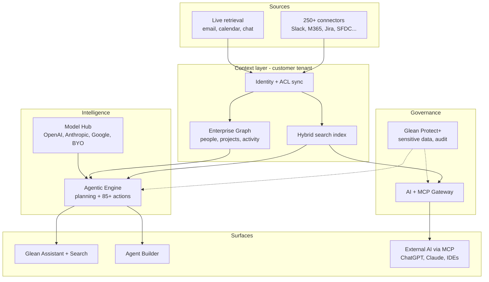

# Glean — Product Direction & Opportunity Report

> **Sample output.** Generated on Sep 23, 2026 by an early version (v0.1) of `product-direction-research`, using public sources only. Revenue figures, scores and charters are the agent's estimates, not disclosed data. This is not investment advice, and it is not affiliated with or endorsed by Glean. Current versions of the skill add a defensibility scorecard, AI-era tests, scenarios and a cross-model review.

## Executive summary

Glean is moving from enterprise search to a neutral, permission-aware "context layer" that any AI model or agent calls, and it sells that layer on lowering customers' AI bills (confidence: high). The largest untapped opportunity is charging for that context when it is called from rivals' front ends.

- **Momentum (fact):** $300M ARR in May 2026, up from $100M 15 months earlier; $7.2B valuation (Jun 2025); about $770M raised.
- **Top 3 opportunities:**
  1. Context-as-a-service, a metered MCP and API SKU (4.45)
  2. Transparent pricing and a mid-market tier (4.20)
  3. Agent reliability and trust (4.05)
- **Top 2 partnerships:** Anthropic/Claude, for integration and co-selling; and AWS, Google Cloud and Azure marketplaces, where spend counts against customers' cloud commitments.
- **Revenue impact (estimate):** about $75M of incremental ARR in the base case (range $24M–$165M) across the top four opportunities, over 4–8 quarters.
- **Principal PM charter to own:** Glean Context Platform. It comes with a 90-day plan that ends in a go/no-go decision on general availability.
- **Biggest blind spot:** pricing opacity. Buyers name it as their loudest complaint, and nothing Glean has said or shipped addresses it.
- **Biggest risk:** the squeeze from both ends, with bundling by Microsoft, Google and Atlassian above and data owners like Slack restricting API access below.

## Company snapshot and funding

Glean is a private enterprise AI company founded in 2019. It reported [$300M ARR in May 2026](https://www.glean.com/press/glean-surpasses-300m-arr-unrivaled-enterprise-context-fuels-ai-adoption), three times the $100M it had 15 months earlier, and it has raised about $770M. Its last price was a [$7.2B valuation in June 2025](https://www.glean.com/press/glean-raises-150m-series-f-at-7-2b-valuation-to-accelerate-enterprise-ai-agent-innovation-globally). At $300M ARR that is about 24x revenue, which is modest for a company in enterprise AI.

| Round | Date | Amount | Lead(s) | Post-money |
| --- | --- | --- | --- | --- |
| [Series F](https://www.glean.com/press/glean-raises-150m-series-f-at-7-2b-valuation-to-accelerate-enterprise-ai-agent-innovation-globally) | Jun 2025 | $150M | Wellington Management | $7.2B |
| [Series E](https://www.glean.com/blog/glean-series-e-prompting-launch) | Sep 2024 | $260M+ | Altimeter, DST Global | $4.6B |
| [Series D](https://www.glean.com/press/glean-announces-over-200m-series-d-to-accelerate-secure-deployment-of-generative-ai-in-the-enterprise) | Feb 2024 | $200M+ | Kleiner Perkins, Lightspeed (plus strategic investors Databricks Ventures and Workday Ventures) | $2.2B |
| Series C | May 2023 | $100M | Sequoia, General Catalyst | $1B (as reported by [Sacra](https://sacra.com/c/glean/)) |

**ARR trajectory (disclosed):** more than $100M in the fiscal year ending Jan 2025, then [$200M in Dec 2025](https://www.glean.com/press/glean-surpasses-200m-in-arr-for-enterprise-ai-doubling-revenue-in-nine-months), then $300M in May 2026. [TechCrunch notes](https://techcrunch.com/2026/05/28/gleans-top-line-crosses-300m-as-ai-budget-cutting-becomes-its-major-selling-point/) that part of the $300M is annualized consumption revenue, not strictly contracted ARR.

**Use of funds (Series F):** Glean said the money would go to "continued product innovation, the expansion of its partner ecosystem, and international growth." Its stated agent goal was to grow from 100M+ agent actions a year to 1B.

**Scale signals (disclosed):**

- 800+ employees ([Crunchbase News](https://news.crunchbase.com/venture/ai-powered-work-assistant-glean-valuation-jumps/), Jun 2025)
- Fortune 500 customer count nearly doubled year over year
- $1M+ contracts nearly tripled (Dec 2025)
- Operations in 28 countries, with new entities in Canada and Australia
- 45% wDAU/wMAU
- 85%+ of customers deploy across 5+ departments
- Customers include Databricks, Reddit, Pinterest, Samsung, Booking.com, Comcast, eBay, Intuit and LinkedIn

**Investors:** Sequoia, Kleiner Perkins, Lightspeed, General Catalyst, ICONIQ, Altimeter, DST, Coatue, IVP, Sapphire, SoftBank VF2, Wellington, Khosla, Citi and Capital One Ventures. Citi and Capital One are strategic investors, and both are also customers.

**Hiring signal:** not measured. The Greenhouse job board fetch was not approved during this run. The careers site shows SF and Palo Alto hubs plus localized Japanese and French pages, which suggests a Japan and France/EMEA push (inference).

## Current product and stated direction

Glean is repositioning from enterprise search to being the "enterprise context" layer: the permissioned data and graph that any AI model or agent uses to act. It now sells this layer as a way to lower customers' AI spend, not only as a place to find answers. The 2026 releases point in three directions:

- an agent platform
- openness to other AI front ends (MCP, ChatGPT, bring-your-own model)
- governance

| Date | Launch | What it signals |
| --- | --- | --- |
| May 2026 | [Auto Mode agents GA, natural-language builder, sandbox; Glean Protect+ sensitive-content detection; BYO-LLM model picker; one-click Glean inside ChatGPT; Sigma and Azure DevOps connectors](https://docs.glean.com/release-notes/releases/2026-05-20-may-release) | Agents move from demo to production; Glean distributes through rival front ends |
| May 2026 | [Enterprise Context Intelligence (activity graph, skill discovery), Model Hub and MCP Gateway, Glean Protect](https://www.glean.com/press/glean-surpasses-300m-arr-unrivaled-enterprise-context-fuels-ai-adoption) | Context graph as the moat; model- and cloud-neutral |
| Feb 2026 | [85+ agent actions, 8 engineering agents, chat-based admin and insights](https://www.glean.com/product-drop/february-2026) | Moving from reading data to writing actions; entering developer workflows |
| 2025 | [Glean Agents, Agentic Engine 2, third-generation Assistant; 200 features shipped](https://www.glean.com/press/glean-surpasses-200m-in-arr-for-enterprise-ai-doubling-revenue-in-nine-months) | The shift from search to an agent platform |

**Pricing:** Glean has moved to a hybrid model called [Enterprise Flex](https://docs.glean.com/glean-enterprise-flex-pricing).

- A per-user seat includes unlimited search, fast-mode chat and uploads.
- A pooled allowance of FlexCredits is metered for thinking and premium-model queries, agent runs, deep research, slides, code generation and API calls.
- A premium-model query costs about 35–120 credits; an agent run about 7–114.
- [Vendr data](https://www.vendr.com/marketplace/glean) from 174 purchases shows a median contract of about $99K a year, a range of $30K–$209K, and average negotiated savings of about 20%.

**Leadership message:** [CEO Arvind Jain](https://techcrunch.com/2026/05/28/gleans-top-line-crosses-300m-as-ai-budget-cutting-becomes-its-major-selling-point/) (May 2026) said: "we can reduce your AI bill significantly." He also said: "The first four or five years of our existence, we had no competition." That is no longer true. Google, Microsoft, OpenAI, Anthropic, Salesforce and Atlassian now all ship enterprise AI search.

**Glean's own benchmark claims** (not independently verified): 2.5x preferred over off-the-shelf MCP tools, 30% fewer tokens, and a 73% win rate on complex queries.

## High-level architecture

Glean's defensible asset is the middle of the stack. It keeps a permission-aware index and an Enterprise Graph inside the customer's own cloud tenant, and sells access to that context through its own apps and through rival AI front ends (MCP, ChatGPT). The models themselves are interchangeable parts. The diagram below is reconstructed from public docs; internal details are inferred.



Data flows top to bottom. Every path passes through identity and ACL sync, so an answer never exposes content the user couldn't open in the source app.

| Layer | What it does | Public source |
| --- | --- | --- |
| Connectors | Indexed, live, or hybrid access. They bring in metadata, content, ACLs, identity mapping, and activity signals (views, edits, shares). | [How connectors power Glean](https://docs.glean.com/connectors/connectors-power-glean) |
| Enterprise Graph | Entities (people, projects, customers, products) and their relationships, plus personal and activity graphs. Used for ranking and multi-hop agent reasoning. | [Enterprise Graph](https://www.glean.com/product/enterprise-graph) |
| Model Hub | Model-neutral: standard and premium tiers from OpenAI, Anthropic and Google, plus bring-your-own LLM keys | [Enterprise Flex](https://docs.glean.com/glean-enterprise-flex-pricing), [May 2026 release](https://docs.glean.com/release-notes/releases/2026-05-20-may-release) |
| Agents | Agentic Engine 2, Auto Mode agents, a natural-language builder, a sandbox, and 85+ write actions | [Feb 2026 drop](https://www.glean.com/product-drop/february-2026) |
| MCP Gateway (Jun 2026) | Governed remote MCP servers with OAuth via the customer's IdP, MDM rollout, and usage observability. Works with Claude and other MCP hosts. | [MCP Gateway blog](https://www.glean.com/blog/introducing-glean-mcp-gateway) |
| Deployment | Runs in the customer's own cloud tenant. On-prem on Dell AI Factory since May 2025. | [Hosting architectures](https://www.glean.com/perspectives/understanding-glean-and-claude-enterprise-hosting-architectures), [Dell on-prem](https://www.glean.com/press/glean-delivers-ai-agents-and-enterprise-search-to-on-premises-environments-in-collaboration-with-dell-technologies) |

**Strategic read (inference):** the more AI front ends there are (Copilot, ChatGPT, Claude, Gemini), the more valuable a neutral, permissioned context layer becomes. The risk is that front-end owners build context layers of their own, which would push Glean down to being a connector vendor.

## Voice of the customer

People who use Glean like it: it rates 4.7/5 on both G2 and AWS Marketplace. The complaints come from buyers, and they are about cost, pricing opacity, and whether Glean's edge holds up as the big platforms bundle search. Coverage of Reddit is thin (see Methodology), so this section leans on reviews, Hacker News, Blind and analyst comparisons.

| Theme | Type | Mentions | Intensity | Segment | Evidence |
| --- | --- | --- | --- | --- | --- |
| Finds answers across siloed apps fast; easy to use | Praise | High (8+ G2 pros, most AWS reviews) | — | All | [G2](https://www.g2.com/products/glean-technologies-glean/reviews?qs=pros-and-cons): "One search across all of those… without the manual hunt-and-ask cycle" |
| Expensive, especially for smaller orgs; no list price | Pain point | Medium–high (AWS, HN, 3+ buyer guides) | High | Mid-market, procurement | [AWS reviews](https://aws.amazon.com/marketplace/reviews/reviews-list/prodview-3hxyfnuih42u2?page=10): "Pricing might be a bit high for small companies"; [ExploreAgentic](https://www.exploreagentic.ai/comparisons/glean-pricing-alternatives/): a 100-seat floor, paid POCs up to $70K |
| Value erosion as frontier LLMs and bundled copilots improve | Churn reason | Low–medium | High | SMB, mid-market | [AWS reviews](https://aws.amazon.com/marketplace/reviews/reviews-list/prodview-3hxyfnuih42u2?page=10): "The LLMs are getting better… we no longer saw the value"; [Beri, Aug 2026](https://www.beri.net/article/glean-vs-microsoft-365-copilot-vs-dust-enterprise-search-2026): "squeezed from both ends" |
| Meter anxiety: FlexCredits overage rates aren't published | Pain point | Medium (buyer guides) | Medium | Finance, IT | [Beri](https://www.beri.net/article/glean-vs-microsoft-365-copilot-vs-dust-enterprise-search-2026); [Enterprise Flex docs](https://docs.glean.com/glean-enterprise-flex-pricing) |
| Answer accuracy and confidence; results too broad; weak filters | Pain point / feature request | Medium (G2 cons, AWS) | Medium | End users | [G2](https://www.g2.com/products/glean-technologies-glean/reviews?qs=pros-and-cons): "I end up having to go to Slack and search myself" |
| Agents are inconsistent; users want richer custom agents and admin visibility | Feature request | Low–medium | Medium | Power users, admins | [AWS reviews](https://aws.amazon.com/marketplace/reviews/reviews-list/prodview-3hxyfnuih42u2?page=10): "Sometimes the agent does not perform well" |
| Slack coverage degraded: indexed Slack replaced by live RTS search | Pain point (platform-driven) | Medium (press + docs) | High | Slack-heavy orgs | [Computerworld](https://www.computerworld.com/article/4005509/salesforce-changes-slack-api-terms-to-block-bulk-data-access-for-llms.html); [Glean RTS docs](https://docs.glean.com/connectors/native/slack/setup/slack-rts-connector): rate limits, per-user authorization |
| "Not very extensible"; demand for open-source or self-hosted search | Competitor comparison | Low (HN) | Medium | Engineering-led orgs | [HN: Omni launch](https://news.ycombinator.com/item?id=47215427): "some orgs find Glean to be expensive and not very extensible" |
| Works far better in production than DIY on Bedrock or Amazon Q | Praise / comparison | Low (Blind, older) | — | Enterprise IT | [Blind](https://www.teamblind.com/post/glean-vs-amazon-q-vs-amazon-bedrock-acyhk6qf) |

**Trend (signal):** the praise is steady, but the objections have moved over the last 12 months. They used to be about search quality; now they are about cost, lock-in and bundling. The shift lines up with three events:

- Copilot Search included in M365 Copilot at $30 a user a month
- Slack's May 2025 API change
- the Enterprise Flex consumption meter

## Developer signal

Glean is not an open-source company. Its GitHub is a set of SDKs and integration kits, not a place where the community asks for features, so the developer signal here comes from what Glean ships for developers rather than from issue reactions. The direction is clear: Glean is becoming a platform that other agents call. It is moving from local MCP servers to a managed remote MCP server, and adding event triggers and toolkits for other agent frameworks.

| Date | Item | Signal |
| --- | --- | --- |
| Aug 2026 | [Platform Triggers API](https://developers.glean.com/changelog/) (experimental, signed webhooks) | Event-driven agents, not only chat-driven |
| Aug 2026 | [Indexing SDK v1.0](https://developers.glean.com/changelog/) with a connector factory | Encourages customers and ISVs to build long-tail connectors |
| Aug 2026 | [Agent import endpoint; tool-server endpoints](https://developers.glean.com/changelog/) | Agents that move between systems; third-party tools |
| Jul–Aug 2026 | [mcp-config](https://developers.glean.com/changelog/) adds Cursor Team, Copilot Studio and Gemini Enterprise | Distribution through competitors' front ends |
| Jul 2026 | [Agent Toolkit v0.7](https://github.com/gleanwork/glean-agent-toolkit) for CrewAI, LangChain and OpenAI | Glean as a tool inside other agent frameworks |
| Jun 2026 | [Local mcp-server archived](https://github.com/gleanwork/mcp-server) (60 stars, 23 forks) in favor of the managed remote server | Centralizes control and metering |
| Sep 2026 | [Chat API streaming content type removed](https://developers.glean.com/changelog/) | Breaking API churn; developer-experience risk |

**Gap:** the numbers are small. 60 stars on the main MCP repo, set against a $300M ARR company, suggests developer adoption is driven by IT admins rather than by grassroots developers. Glean has no free or self-serve developer tier, which is part of why open-source projects like [Omni](https://news.ycombinator.com/item?id=47215427) are showing up (inference).

## Competitive landscape

Glean's competition now comes mostly from platforms that bundle enterprise search into products customers already own, not from other startups. Each of those platforms is strongest over its own data. Glean wins where no single suite reaches a customer's important systems, and where the permission model and answer quality decide the purchase.

| Competitor | Positioning | Price model | Recent move | Where it beats / loses to Glean |
| --- | --- | --- | --- | --- |
| [Microsoft 365 Copilot](https://www.beri.net/article/glean-vs-microsoft-365-copilot-vs-dust-enterprise-search-2026) | Copilot Search on Microsoft Graph | $30/user/mo on top of E3/E5 | Search bundled at no extra cost; 100+ connectors | Wins on price and on shops that are all Microsoft; loses on non-Microsoft systems |
| [Gemini Enterprise](https://coworker.ai/blog/gemini-enterprise-pricing) (formerly Agentspace) | Google's agent and search platform | $21–$60/seat plus metered usage | Renamed and repriced within the last year | Wins in Google Workspace shops and on price; product is still young |
| [ChatGPT company knowledge](https://www.reworked.co/knowledge-findability/openai-pushes-into-enterprise-search-with-company-knowledge/) | Front end people already use, with connectors | Included in Business and Enterprise plans | Launched Oct 2025 | Wins on everyday reach; [Glean's own eval](https://www.glean.com/blog/enterprise-search-evaluation-2026) says Glean is preferred 1.9x (vendor-run) |
| Claude Enterprise | Model plus connectors and MCP | Seat-based | Enterprise search and connectors | Glean's eval says 1.6x preferred; Claude is also a Glean distribution partner via MCP Gateway |
| [Atlassian Rovo](https://www.eesel.ai/blog/atlassian-intelligence-and-rovo-pricing-explained) | Search and agents bundled into Jira and Confluence | Included; credits (25–150 per user/mo) | Overage not billed as of May 2026 | Free for Atlassian shops; only 30+ connectors |
| [ServiceNow + Moveworks](https://newsroom.servicenow.com/press-releases/details/2025/ServiceNow-completes-acquisition-of-Moveworks/default.aspx) | Employee assistant plus search inside ITSM | Custom | Acquisition closed Dec 2025; 100+ enterprises, 5.5M users | Wins on IT and HR service workflows |
| Slack / Salesforce (Agentforce, Slack Enterprise Search) | Owns chat data and restricts API access | Bundled | [API terms change, May 2025](https://www.computerworld.com/article/4005509/salesforce-changes-slack-api-terms-to-block-bulk-data-access-for-llms.html) | Controls a critical data source |
| Open source: [Onyx](https://onyx.app/insights/glean-alternatives), [Omni](https://news.ycombinator.com/item?id=47215427); Dust | Self-hosted or cheaper | Free / low | Growing interest on HN | Wins on cost and extensibility; weaker permissions ([Dust uses space-based ACLs](https://www.beri.net/article/glean-vs-microsoft-365-copilot-vs-dust-enterprise-search-2026)) |

**Read (inference):** Glean's winning pitch has become "neutral context across every AI you use, at a lower token bill." The same distribution channels it now relies on (ChatGPT, Claude, Copilot Studio, Gemini) belong to its biggest competitors.

## Key product growth opportunities

The top opportunity is to charge for Glean's context layer as metered infrastructure that any AI front end can call. The second is to fix pricing opacity, which is the loudest objection from buyers. Scores are 1–5 on each dimension. Priority = 0.25 × Demand + 0.2 × Fit + 0.25 × Revenue + 0.15 × Ease + 0.15 × Urgency. All scores are the analyst's judgment (inference).

| # | Opportunity | Type | Evidence (2+ signals) | Demand | Fit | Revenue | Ease | Urgency | Priority |
| --- | --- | --- | --- | --- | --- | --- | --- | --- | --- |
| 1 | **Context-as-a-service:** meter MCP Gateway and API context calls from ChatGPT, Claude, Copilot Studio and Gemini as their own SKU | Platform / API | MCP Gateway launch (Jun 2026); mcp-config adds rival clients; local MCP server archived for the managed one; buyers say value is eroding as LLMs improve | 4 | 5 | 5 | 3 | 5 | **4.45** |
| 2 | **Transparent, predictable packaging:** a published list price, a mid-market tier below the 100-seat floor, and caps or alerts on FlexCredits | Packaging / pricing | Pricing is the top complaint (AWS reviews, HN, buyer guides); no list price; unpublished overage rates; Copilot at $30 and Gemini at $21 are public | 5 | 3 | 4 | 4 | 5 | **4.20** |
| 3 | **Agent reliability and trust:** eval harnesses, confidence and citation scoring, run debugging, admin quality dashboards | Fix churn driver | "agent does not perform well" and "not always 100% accurate" in reviews; Auto Mode GA added sandbox and debug views; target of 1B agent actions | 4 | 5 | 4 | 3 | 4 | **4.05** |
| 4 | **AI FinOps:** productize "reduce your AI bill" with model routing, token budgets and a savings report across all AI tools | New product | CEO pitch (May 2026); claimed 30% fewer tokens; Model Hub plus BYO keys; buyers anxious about the meter | 3 | 5 | 4 | 4 | 4 | **3.95** |
| 5 | **Proactive, event-driven agents** from the activity graph and Triggers API ("work that starts itself") | New feature | Triggers API (Aug 2026); Enterprise Context Intelligence activity graph; agents currently mostly chat-initiated | 3 | 5 | 4 | 3 | 3 | **3.65** |
| 6 | **Data-access resilience:** federated, zero-copy connectors and a customer-side data-rights program against walled gardens | Fix churn driver | Slack moved to RTS (rate limits, per-user auth); Beri's "rate-limited by source systems" | 4 | 4 | 3 | 2 | 5 | **3.60** |
| 7 | **Sovereign and regulated editions:** on-prem, EU and public-sector packaging | New segment | Dell on-prem (May 2025); new Canada and Australia entities; Japanese and French career sites | 3 | 4 | 4 | 2 | 3 | **3.30** |
| 8 | **Developer and ISV ecosystem:** a free dev tier and a marketplace for connectors and agents | Platform | Indexing SDK v1.0 plus connector factory; Agent Toolkit; low GitHub traction (60 stars); open-source alternatives rising | 3 | 4 | 3 | 3 | 3 | **3.20** |

**Alignment gap:** items 1, 3, 4 and 5 match Glean's stated direction. Item 2 is the clearest blind spot. Customers and procurement keep asking for transparent pricing, and nothing Glean has said or shipped addresses it.

## Partnership opportunities

The two highest-leverage partnerships are Anthropic/Claude and the hyperscaler marketplaces. Both give Glean distribution without its data becoming someone else's moat. Glean already lists AWS, Google, Microsoft, Databricks, Dell, Palo Alto Networks, Snowflake, Workday and Zoom as partners ([Dec 2025 release](https://www.glean.com/press/glean-surpasses-200m-in-arr-for-enterprise-ai-doubling-revenue-in-nine-months)). The opportunity is to deepen those, not add logos.

| Partner | Type | Mutual value | Evidence | Effort |
| --- | --- | --- | --- | --- |
| Anthropic (Claude Enterprise, Claude Cowork) | Integration + co-sell | Claude gets permissioned enterprise context; Glean gets a front end that doesn't compete for search | [MCP Gateway blog](https://www.glean.com/blog/introducing-glean-mcp-gateway) names Claude Cowork; Anthropic models are in the Model Hub | Low |
| AWS / Google Cloud / Azure marketplaces | Marketplace + co-sell | Spend counts against customers' cloud commitments, which shortens procurement and eases the pricing complaint | Glean is on [AWS Marketplace](https://aws.amazon.com/marketplace/reviews/reviews-list/prodview-3hxyfnuih42u2?page=10) (181 ratings); deploys into customer AWS/GCP | Low–medium |
| OpenAI (ChatGPT Enterprise) | Integration ("frenemy") | Glean inside ChatGPT keeps Glean relevant where users already are | [One-click Glean in ChatGPT](https://docs.glean.com/release-notes/releases/2026-05-20-may-release) (May 2026) | Low (already live) |
| Workday, Databricks (strategic investors) | Data partnership + OEM | HR and people data plus the lakehouse become first-class graph entities; Glean context runs inside their agents | [Series D](https://www.glean.com/press/glean-announces-over-200m-series-d-to-accelerate-secure-deployment-of-generative-ai-in-the-enterprise) strategic investors | Medium |
| Dell (plus NVIDIA via AI Factory) | Channel, on-prem | Reaches regulated buyers that can't use the cloud | [Dell on-prem](https://www.glean.com/press/glean-delivers-ai-agents-and-enterprise-search-to-on-premises-environments-in-collaboration-with-dell-technologies) | Medium |
| Palo Alto Networks / CrowdStrike / Okta | Security integration | Glean Protect+ signals feed SIEM and DSPM; the IdP drives agent identity | PANW is a named partner; Protect+ sensitive-content models (May 2026) | Medium |
| Global SIs (Accenture, Deloitte, NTT Data in Japan) | Channel / services | Agent build-outs at scale; international entry | Japanese and French career sites; operations in 28 countries | Medium |
| Citi, Capital One (investor-customers) | Design partners, vertical | Financial-services agent templates and a compliance reference | [Series F](https://www.glean.com/press/glean-raises-150m-series-f-at-7-2b-valuation-to-accelerate-enterprise-ai-agent-innovation-globally) investor list | Low |

**Avoid depending on:** Salesforce/Slack. Its [API change](https://www.computerworld.com/article/4005509/salesforce-changes-slack-api-terms-to-block-bulk-data-access-for-llms.html) shows that a partner who owns the data can shut off access.

## Revenue impact model

Together, the top four opportunities could add roughly **$75M of incremental ARR in the base case** (range $24M–$165M) within 4–8 quarters. That is about 25% on top of the $300M base. These are back-of-envelope estimates, not disclosed figures. The four overlap somewhat, so the totals are an upper bound.

```latex
\text{Impact} = \text{accounts} \times \text{adoption} \times \Delta\text{ARPA} \quad \text{or} \quad \text{ARR base} \times \Delta\text{retention}
```

**Shared assumptions:**

- $300M ARR base ([May 2026](https://www.glean.com/press/glean-surpasses-300m-arr-unrivaled-enterprise-context-fuels-ai-adoption)).
- About **1,200 customers**. This is inferred from $300M divided by an assumed \~$250K blended ACV. The \~$250K sits between [Vendr's \~$99K median](https://www.vendr.com/marketplace/glean), which is skewed toward smaller buyers, and the $1M+ enterprise deals Glean discloses. Glean does not publish its customer count, so this is the weakest assumption in the model.

| Opportunity | Formula | Low | Base | High | Time to impact |
| --- | --- | --- | --- | --- | --- |
| 1. Context-as-a-service (metered MCP and API) | 1,200 × adoption 20 / 35 / 50% × $40K / $75K / $120K | $9.6M | $31.5M | $72.0M | 2–4 quarters |
| 2. Transparent pricing and mid-market tier | New logos 150 / 400 / 800 × $30K / $40K / $50K ACV | $4.5M | $16.0M | $40.0M | 3–6 quarters |
| 3. Agent reliability and trust | $300M × (lower churn 1 / 2 / 3 pts + agent-credit expansion 1 / 3 / 5%) | $6.0M | $15.0M | $24.0M | 2–4 quarters |
| 4. AI FinOps add-on | 1,200 × attach 10 / 20 / 30% × $30K / $50K / $80K | $3.6M | $12.0M | $28.8M | 3–5 quarters |
| **Total** |  | **$23.7M** | **$74.5M** | **$164.8M** |  |

**Most sensitive input:** the price of metered context in opportunity 1. If rival front ends (Copilot, Gemini) push Glean to charge less per call, the base case for opportunity 1 falls by about half.

## Principal PM opportunities

The charter with the most leverage for a Principal PM at Glean is **"Glean Context Platform"**: turning MCP Gateway and the APIs into a metered, reliable product that other AI front ends pay to call. It carries the #1 growth opportunity (priority 4.45, base case about $31.5M ARR) and decides whether Glean ends up as the neutral context layer or as a connector vendor. Each charter below is scoped at Principal level: it cuts across teams, has ambiguous strategy, and carries P&L weight.

| Charter | Problem to solve | Key bets | North-star metric | Guardrails |
| --- | --- | --- | --- | --- |
| **1. Context Platform (MCP and API)** | Rival front ends call Glean context, but Glean has no clean way to charge for it, set SLAs, or observe it | Metered context SKU; latency and quality SLAs by client; developer sandbox; partner tiers for Anthropic, OpenAI, Microsoft and Google | Paid external context calls per week; ARR from context | Answer-quality win rate held at 70% or above; p95 latency |
| **2. Packaging and monetization** | Opaque pricing, a 100-seat floor, and FlexCredit anxiety slow deals and put off the mid-market | Published pricing for core tiers; a mid-market SKU; credit forecasting, alerts and caps; buying through cloud marketplaces | Days from first call to signature; mid-market new logos | Gross margin per credit; enterprise ASP |
| **3. Agent quality and trust** | Agents are inconsistent, and there is little admin visibility, which blocks the path to 1B actions | An eval harness customers can run on their own data; confidence and citation scoring; run replay and debug; certified agent templates | Successful agent runs per week (task completed without human rework) | Hallucination and error rate; permission incidents at 0 |
| **4. Proactive work (event-driven agents)** | Agents wait for a prompt; the activity graph and Triggers API aren't turned into products | Trigger-based agents (for example, deal-risk alerts or incident digests); a "next best action" feed; opt-in controls | Weekly users acting on proactive suggestions | Notification fatigue (dismiss rate); privacy opt-outs |
| **5. Data-access resilience** | Walled gardens (Slack RTS) weaken coverage and ranking signals | Federated and hybrid ranking; per-source health scores; a playbook for customers to assert their API data rights; partnerships for sanctioned access | Coverage-weighted answer quality on key sources | Rate-limit errors; query latency |

**First 90 days, Charter 1 (Context Platform):**

1. **Days 0–30 (discover):** instrument MCP Gateway usage by client and customer. Interview 15 customers using Glean from ChatGPT, Claude or Copilot. Map the current cost to serve each call.
2. **Days 31–60 (define):** write a PRD for the metered context SKU, covering units, price points, and SLAs by tier. Align the partner terms with BD for Anthropic and OpenAI.
3. **Days 61–90 (ship a beta):** a design-partner beta with 5–10 customers, including Citi or Capital One as financial-services references. Build a live dashboard for calls, quality and revenue. Present a go/no-go decision on general availability, with a revenue forecast.

**Why these fit a Principal PM (inference):** each one needs a strategic call that isn't settled by the feature roadmap, such as pricing Glean's context for competitors' front ends or setting a published price. Each spans engineering, go-to-market, partnerships and finance, and ties to a measurable ARR outcome in the revenue model.

## Risks, open questions and what to watch

The biggest risk is being squeezed from both ends: suites bundle search above Glean, and the owners of the data restrict access below it. Most of the other risks follow from that one.

- **Bundling:** Copilot Search, Rovo (overage not billed yet) and Gemini Enterprise ($21 and up) put a ceiling on what Glean can charge per seat, especially in organizations built on a single suite.
- **Data enclosure:** Slack showed that a data owner can [cut off indexing](https://www.computerworld.com/article/4005509/salesforce-changes-slack-api-terms-to-block-bulk-data-access-for-llms.html). Watch for Microsoft Graph or Atlassian doing the same.
- **Channel conflict:** growth through ChatGPT, Claude and Gemini makes Glean depend on competitors' front ends and their terms.
- **Revenue quality:** part of the $300M is [annualized consumption revenue](https://techcrunch.com/2026/05/28/gleans-top-line-crosses-300m-as-ai-budget-cutting-becomes-its-major-selling-point/), which can swing with usage.
- **Vendor-run benchmarks:** the 1.9x, 2.5x and 30%-fewer-tokens claims come from Glean's own evaluations, and no third party has replicated them.

**Open questions:**

- Customer count and net revenue retention (not disclosed)
- Gross margin under Enterprise Flex, given model costs
- Timing of the next round or an IPO. Analysts point to [2027 or later](https://valueaddvc.com/blog/glean-valuation-revenue-2026-300m-arr-enterprise-ai-search).

**Watch:**

- An ARR update at $400M+
- Whether MCP Gateway becomes its own SKU
- Any published price list
- Changes to Microsoft Graph or Atlassian API terms
- New international entities (Japan, EU)

## Sources and methodology

The window was Sep 2025 to Sep 2026, with funding history back to 2023. The lens is PM and strategy (assumed). Labels used: **fact** = disclosed by Glean or a filing; **signal** = observed in public data; **inference** = the analyst's judgment. Scores and revenue figures are inferences.

**Coverage and gaps:**

- **Reddit:** direct API fetches (reddit.com/search.json) needed approval that wasn't given in time, and web search returned no relevant Reddit threads. Coverage is thin; confidence is low. Re-run with Reddit access approved.
- **Hacker News:** the Algolia API fetch was also not approved. Two HN threads were read through search. Confidence is low to medium.
- **Reviews:** G2 (336 reviews, 4.7) and AWS Marketplace (181 ratings, 4.7) were read. Confidence is medium.
- **GitHub:** the API was blocked in this environment. The gleanwork repo pages and the developer changelog were read instead. Confidence is medium.
- **Hiring:** the Greenhouse board fetch was not approved, so hiring signal was not measured.
- **Funding and product:** primary sources (Glean press releases and docs). Confidence is high.

**Confidence by section:** funding high · product high · architecture medium (public docs; internals inferred) · voice of customer medium-low · developer medium · competition medium · opportunities, revenue and PM charters are inferences.

**Sources opened:**

- Glean press: [Series D](https://www.glean.com/press/glean-announces-over-200m-series-d-to-accelerate-secure-deployment-of-generative-ai-in-the-enterprise), [Series E](https://www.glean.com/blog/glean-series-e-prompting-launch), [Series F](https://www.glean.com/press/glean-raises-150m-series-f-at-7-2b-valuation-to-accelerate-enterprise-ai-agent-innovation-globally), [$200M ARR](https://www.glean.com/press/glean-surpasses-200m-in-arr-for-enterprise-ai-doubling-revenue-in-nine-months), [$300M ARR](https://www.glean.com/press/glean-surpasses-300m-arr-unrivaled-enterprise-context-fuels-ai-adoption), [Dell on-prem](https://www.glean.com/press/glean-delivers-ai-agents-and-enterprise-search-to-on-premises-environments-in-collaboration-with-dell-technologies)
- Glean product and docs: [Enterprise Flex](https://docs.glean.com/glean-enterprise-flex-pricing), [May 2026 release](https://docs.glean.com/release-notes/releases/2026-05-20-may-release), [Feb 2026 drop](https://www.glean.com/product-drop/february-2026), [Connectors](https://docs.glean.com/connectors/connectors-power-glean), [Enterprise Graph](https://www.glean.com/product/enterprise-graph), [MCP Gateway](https://www.glean.com/blog/introducing-glean-mcp-gateway), [Hosting](https://www.glean.com/perspectives/understanding-glean-and-claude-enterprise-hosting-architectures), [Slack RTS](https://docs.glean.com/connectors/native/slack/setup/slack-rts-connector), [Search eval](https://www.glean.com/blog/enterprise-search-evaluation-2026), [Dev changelog](https://developers.glean.com/changelog/), [mcp-server repo](https://github.com/gleanwork/mcp-server)
- Press and analysts: [TechCrunch](https://techcrunch.com/2026/05/28/gleans-top-line-crosses-300m-as-ai-budget-cutting-becomes-its-major-selling-point/), [Crunchbase News](https://news.crunchbase.com/venture/ai-powered-work-assistant-glean-valuation-jumps/), [Sacra](https://sacra.com/c/glean/), [ValueAdd VC](https://valueaddvc.com/blog/glean-valuation-revenue-2026-300m-arr-enterprise-ai-search), [Computerworld](https://www.computerworld.com/article/4005509/salesforce-changes-slack-api-terms-to-block-bulk-data-access-for-llms.html), [Beri](https://www.beri.net/article/glean-vs-microsoft-365-copilot-vs-dust-enterprise-search-2026), [Reworked](https://www.reworked.co/knowledge-findability/openai-pushes-into-enterprise-search-with-company-knowledge/)
- Pricing and reviews: [Vendr](https://www.vendr.com/marketplace/glean), [ExploreAgentic](https://www.exploreagentic.ai/comparisons/glean-pricing-alternatives/), [G2](https://www.g2.com/products/glean-technologies-glean/reviews?qs=pros-and-cons), [AWS Marketplace](https://aws.amazon.com/marketplace/reviews/reviews-list/prodview-3hxyfnuih42u2?page=10), [Blind](https://www.teamblind.com/post/glean-vs-amazon-q-vs-amazon-bedrock-acyhk6qf), [HN Omni](https://news.ycombinator.com/item?id=47215427)
- Competitors: [Gemini Enterprise pricing](https://coworker.ai/blog/gemini-enterprise-pricing), [Rovo pricing](https://www.eesel.ai/blog/atlassian-intelligence-and-rovo-pricing-explained), [ServiceNow–Moveworks](https://newsroom.servicenow.com/press-releases/details/2025/ServiceNow-completes-acquisition-of-Moveworks/default.aspx)
